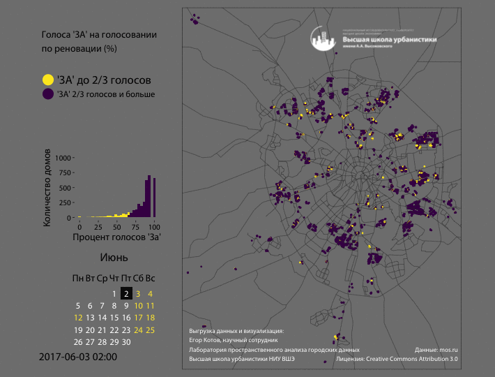
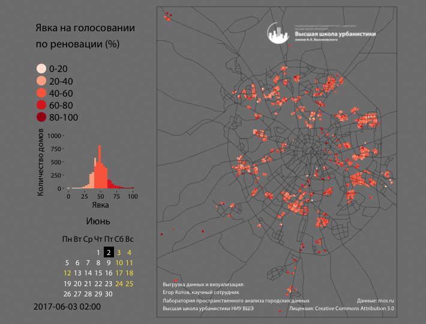

# Данные по голосованию по реновации пятиэтажек в Москве (2017)

*Файл отформатирован при помощи Markdown - лучше всего просматривать текстовом редакторе с поддержкой этого типа форматирования.*

Здесь опубликованы данные **по динамике голосования** по проекту реновации, а также **данные по индивидуальным голосам** в удобных для анализа форматах.

## Описание структуры папок и данных

| Папка          | Описание                                 |
| -------------- | ---------------------------------------- |
| processed_data | итоговые CSV файлы в gzip-архивах, собранные из исходных данных |
| raw_data       | исходные данные (html и geojson файлы)   |

### Содержимое папки processed_data

#### individual_votes.csv.gz -> individual_votes.csv

Данный файл содержит данные по индивидуальным решениям собственников и нанимателей, а также итоговые голоса по квартирам. Дополнительно эти данные обогащены при помощи данных о сами зданиях - к ним добавлены координаты зданий и адреса. Исходные данные в raw_data/raw_individual_vote_results_html.7z  и raw_data/raw_snapshot_data_geojson.7z .

| Поле            | Описание                                 |
| --------------- | ---------------------------------------- |
| unom            | УНОМ БТИ дома                            |
| apartment_id    | уникальный идентификатор кваритры        |
| apartment_vote  | итоговый голос по квартире (За / Против / Не определен - в случае равного количества индивидуальных голосов по соответствующей квартире) |
| indiv_id        | уникальный идентификатор гражданина      |
| indiv_vote      | голос гражданина (За / Против)           |
| indie_vote_date | дата голосования гражданина              |
| name            | Адрес дома                               |
| X               | координата X (географическая долгота в системе координат WGS 84) |
| Y               | координата Y (географическая широта в системе координат WGS 84) |

#### vote_dynamics_by_building_full.csv.gz -> vote_dynamics_by_building_full.csv

Данный файл является полной версией со всеми 15-минутными интервалами замера. Он абсолютно избыточен, т.к. большая часть данных дублируется в виду редкого обновления информации на странице [mos.ru/renovation](http://mos.ru/renovation). Исходные данные в raw_data/raw_snapshot_data_geojson.7z .

#### vote_dynamics_by_building.csv.gz -> vote_dynamics_by_building.csv

Данный файл является сокращенной копией вышеописанного файла. Обладает такой же структурой (см. ниже), но из него удалены все повторяющиеся данные, по сути оставлены только полтора десятка ""замеров"", которые реально отличаются. Исходные данные в raw_data/raw_snapshot_data_geojson.7z .

| Поле                | Описание                                 |
| :------------------ | ---------------------------------------- |
| unom                | УНОМ БТИ дома                            |
| updated_at          | дата обновления в формате ДД.ММ          |
| status              | Для всех установлено значение – в списке |
| district_name       | Название округа г. Москвы (аббревиатура) |
| name                | Адрес дома                               |
| area_name           | Название района г. Москвы                |
| result_unom_type    | 1 – Дом проголосовал "ЗА" или "ПРОТИВ"; 6 – Дом признан бесхозным. Идет судебная процедура признания права собственности города Москвы. |
| result_za           | Процент голосов "ЗА" (по квартирам) (в сумме с result_protiv должно быть 100) |
| result_protiv       | Процент голосов "ПРОТИВ" (по квартирам) (в сумме с result_za должно быть 100) |
| result_yavka        | Явка (в %)                               |
| result_und_mark     | 0 – Все голоса в доме учтены без "конфликтов" в квартирах. 1 – Не учтены голоса (мнения собственников или нанимателей квартир разделились поровну) |
| result_und          | 0 – Все голоса в доме учтены без "конфликтов" в квартирах. 1,2,3,4 – не учтены n квартир, мнения собственников или нанимателей квартир разделились поровну |
| result_protocol_res | 0 – В доме не проходило общее собрание собственников помещений. 1 – В доме прошло общее собрание собственников помещений. |
| result_house_status | 1 – Дом проголосовал "ЗА"; 2 – Дом проголосовал "ПРОТИВ"; 3 – Дом признан бесхозным. Идет судебная процедура признания права собственности города Москвы. |
| ts                  | Дата и время получения данных со страницы [mos.ru/renovation](http://mos.ru/renovation). Формат  ГГГГ-ДД-ММTЧЧ:мм:ссZ в UTC |
| sample_id           | Текстовый уникальный идентификатор 15-минутного "замера". Построен на базе даты и времени замера в формате ГГГГДДММЧЧммсс по московскому времени (в 2017 году это GMT+3) |
| X                   | координата X (географическая долгота в системе координат WGS 84) |
| Y                   | координата Y (географическая широта в системе координат WGS 84) |

### Содержимое папки raw_data

#### raw_snapshot_data_geojson.7z

Архив содержит geojson файлы с запечатленными состояниями голосования с 15-минутными интервалами с 02:00:53 2017-06-03 до 12:05:16 2017-06-18 (есть некоторые пробелы в интервалах в самом начале и в самом конце периода). Имена файлов включают дату и время получения данных со страницы mos.ru/renovation. Впрочем эти данные избыточны, на самом деле изменения в публикуемых данных происходили гораздо реже.

Результаты объединения этих файлов расположены в processed_files/vote_dynamics_by_building_full.csv.gz и в  processed_files/vote_dynamics_by_building.csv.gz (сильно сокращенный вариант без дублирующих наблюдений).

При распаковке файлы занимают около 4.5 Гб.

#### raw_individual_vote_results_html.7z

Архив содержит html файлы с таблицами, извлеченными из соответствующих страниц сайта mos.ru, генерируемыми для каждого дома в голосовании по проекту реновации.

Результаты объединения этих файлов расположены в processed_files/individual_votes.csv.gz .

При распаковке файлы занимают около 106 Мб.

